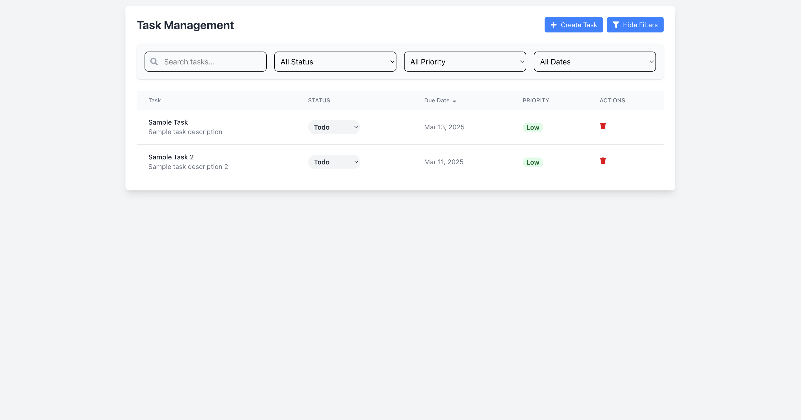

# Task Management Dashboard

This project is a **React + TypeScript** implementation of a **Task Creation Modal** using **Formik**, **Yup**, and **Redux**. It allows users to create tasks with validation, set priorities, and manage statuses seamlessly.

## 🚀 Features

- **Formik for form handling**
- **Yup for validation** (All fields are required)
- **Headless UI Dialog for the modal**
- **Redux Toolkit for state management**
- **TypeScript for type safety**

## 📦 Installation

Clone the repository and install dependencies:

```bash
git clone https://github.com/harshpatel2125/task_manager.git
cd task_manager
npm install  # or yarn install
```

## 🛠 Usage

Run the development server:

```bash
npm run dev  # or yarn dev
```

## 📝 How It Works

- Open the **Create Task Modal**
- Fill in all the required fields (Title, Description, Status, Priority, Due Date)
- Click **Create** to add the task (stored in Redux state)
- Click **Cancel** to close the modal without saving

## 🏗 Technologies Used

- **React** + **TypeScript**
- **Formik** (Form handling)
- **Yup** (Form validation)
- **Redux Toolkit** (State management)
- **Headless UI** (Accessible UI components)

## 📸 Screenshots




## 🤝 Contributing

1. Fork the repository
2. Create a new branch (`git checkout -b feature-branch`)
3. Commit your changes (`git commit -m 'Add new feature'`)
4. Push to the branch (`git push origin feature-branch`)
5. Open a Pull Request

## 📄 License

This project is licensed under the MIT License - see the [LICENSE](LICENSE) file for details.

## 📬 Contact

For questions or collaboration, reach out via:

- GitHub: [harshpatel2125](https://github.com/harshpatel2125)
- Email: harshpatel2125@gmail.com
